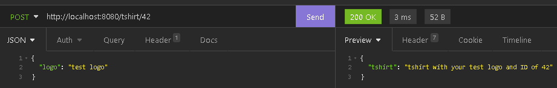
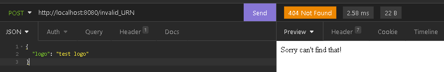
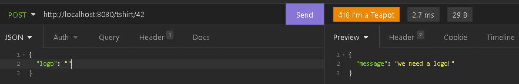
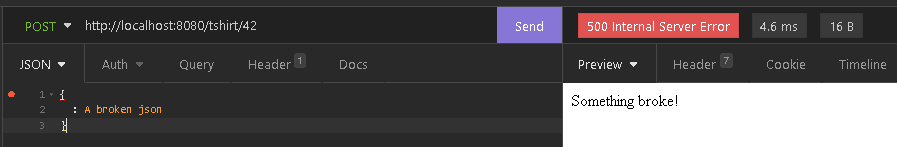

  <!--  -->
  

<h1>
  A Simple REST API Example  
</h1>

<!-- Some cool screenshots of the project: -->

## :computer: Project:
A simple REST API example.

## :sparkles: Technologies Used:
- Javascript
- Node.js
- Project started using `npm init`

Dev dependencies:
- Express: `yarn add express` (the most common framework for building RESTful APIs in Node.js)

<!-- ## :hammer_and_wrench: Features:
- Features of the application itself.
- Funcionalidades da aplicação em si.
-  -->

## :scroll: Interesting References:
- How to build a REST API.
- How to create different endpoints for the API.
- How to request and receive data.
- How to set some middleware functions.

### How to make API requests and view the response:
- From a CLI using _curl_. Ex.: `curl http://localhost:8080/`.
- Using a VSCode extension like _REST Client_ or _Thunder Client_.
- Installing a REST client application like _[Insomnia](https://insomnia.rest/download)_ or _[Postman](https://www.postman.com)_.
- Using an [open source](https://github.com/hoppscotch/hoppscotch) API development ecosystem project like _[hoppscotch](https://hoppscotch.io/)_.

### Documenting APIs:
Open APIs documentations should follow the [OpenAPI Specification](https://spec.openapis.org/oas/latest.html). 
Some boilerplate code and documentation can be automatically generated using services like [Swagger Hub](https://swagger.io/specification/#:~:text=The%20OpenAPI%20Specification%20(OAS)%20defines,or%20through%20network%20traffic%20inspection.) or [WordPress](https://developer.wordpress.org/rest-api/).

## :rocket: Getting Started:
Run **`yarn`**, **`npm install`** or **`npm i`** to download and install project dependencies. 
Run **`node index.js`**, **`yarn dev`** or **`npm run dev`** to start the project's _development server_ on localhost. 
Run **`nodemon index.js`** instead if you want to listen for file changes.

## :memo: License:
This project is licensed under the [MIT License](https://opensource.org/licenses/MIT) - see the [`LICENSE`](LICENSE) file for details.

  <small>Project developed by <a href="https://github.com/Paulo-Krg">Paulo Krüger</a> - march/2022</small>

